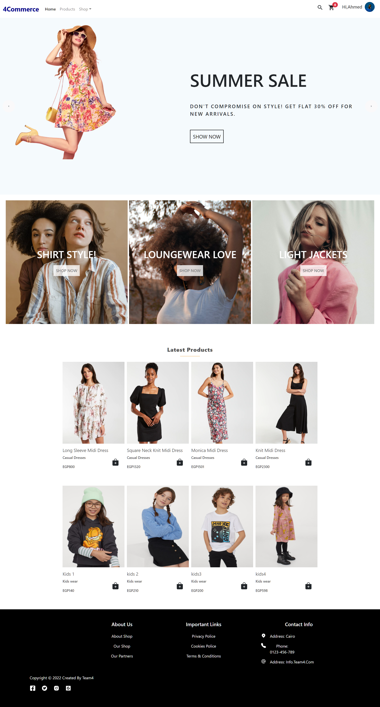
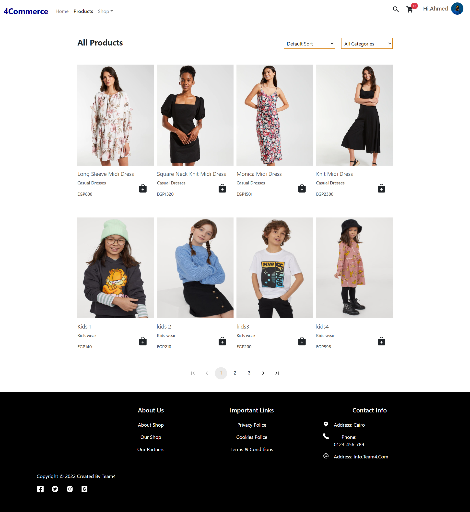
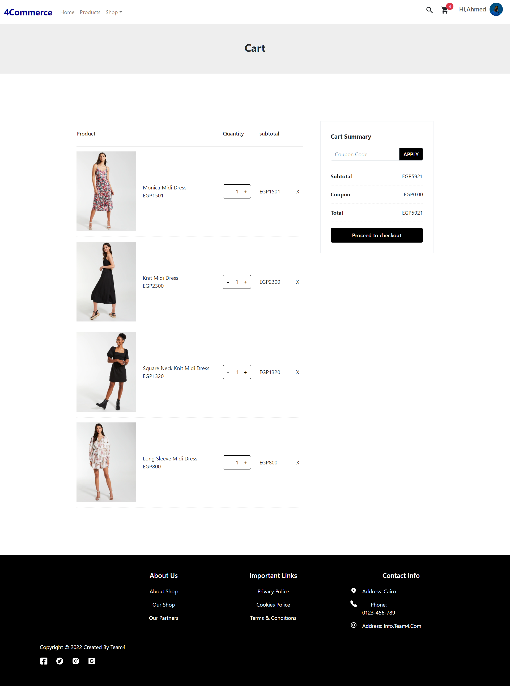
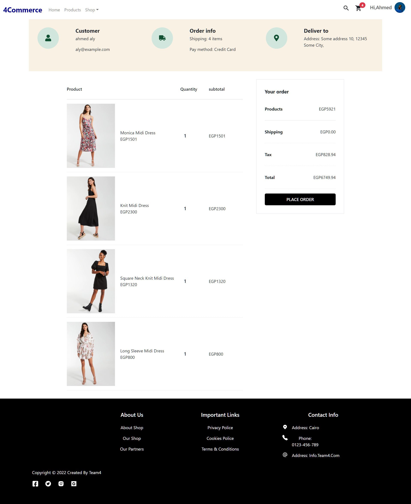
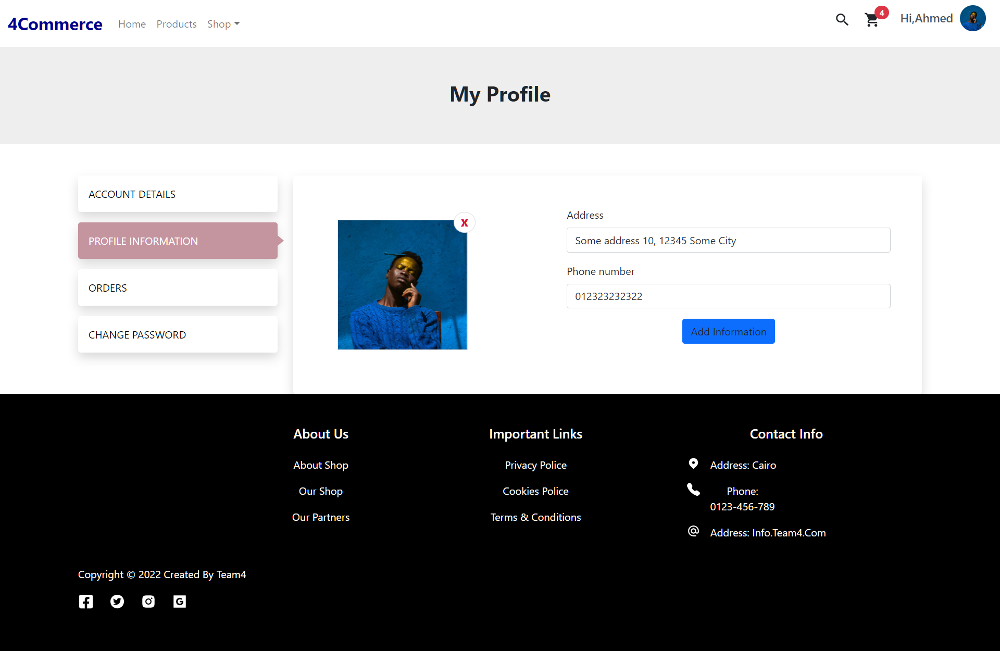
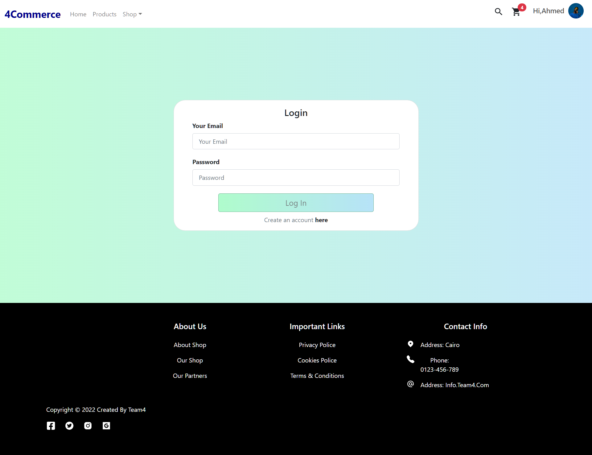
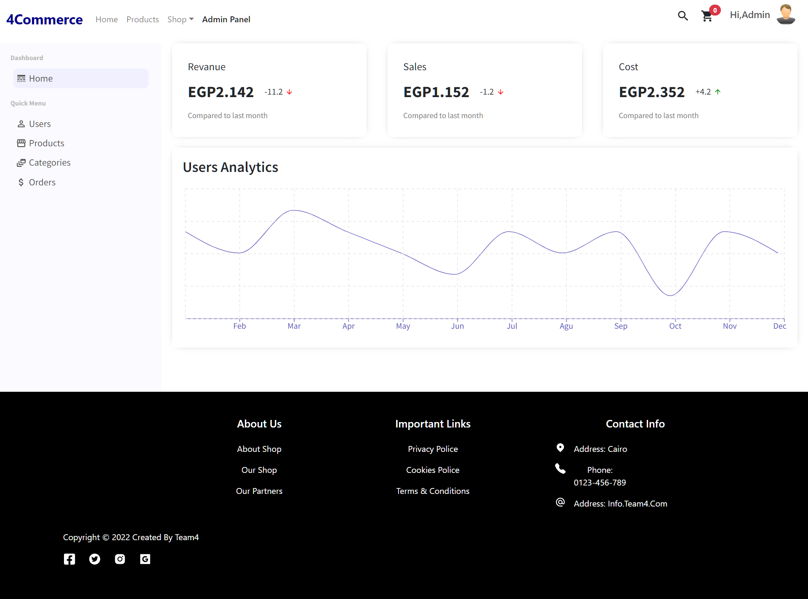
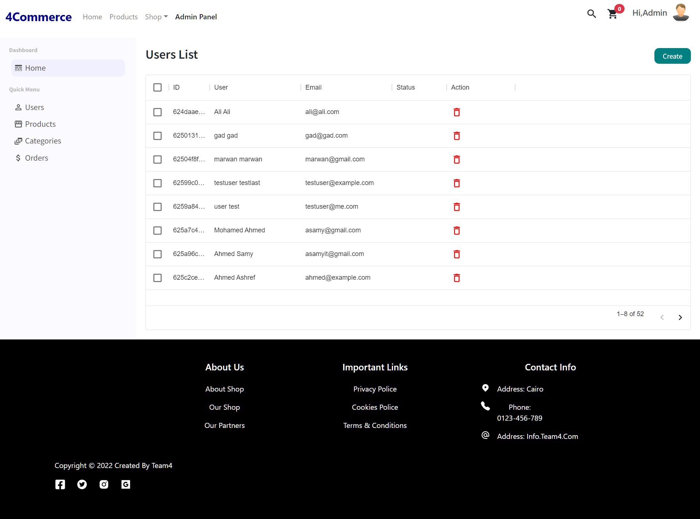
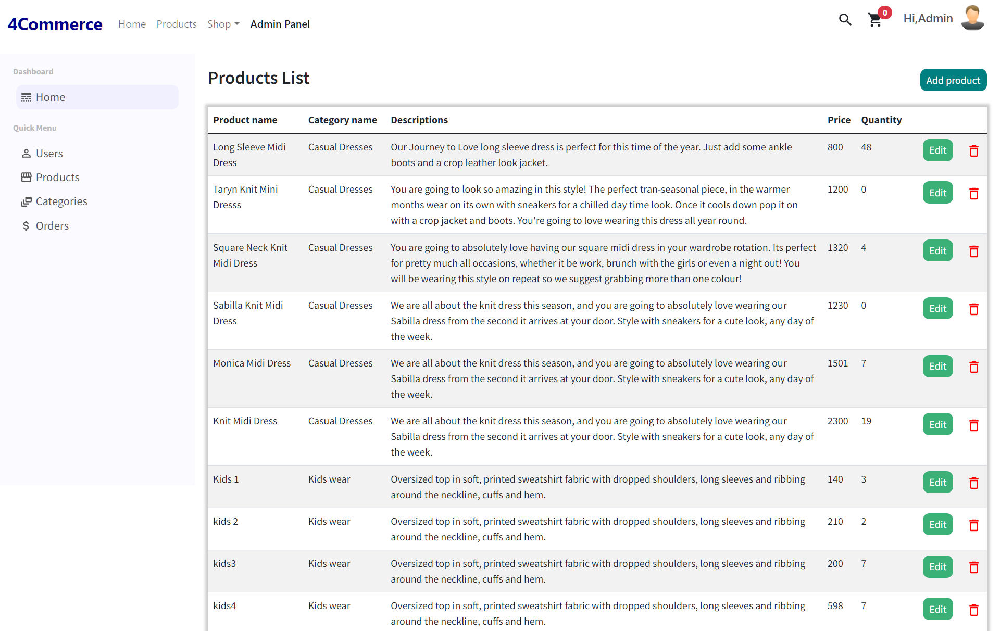
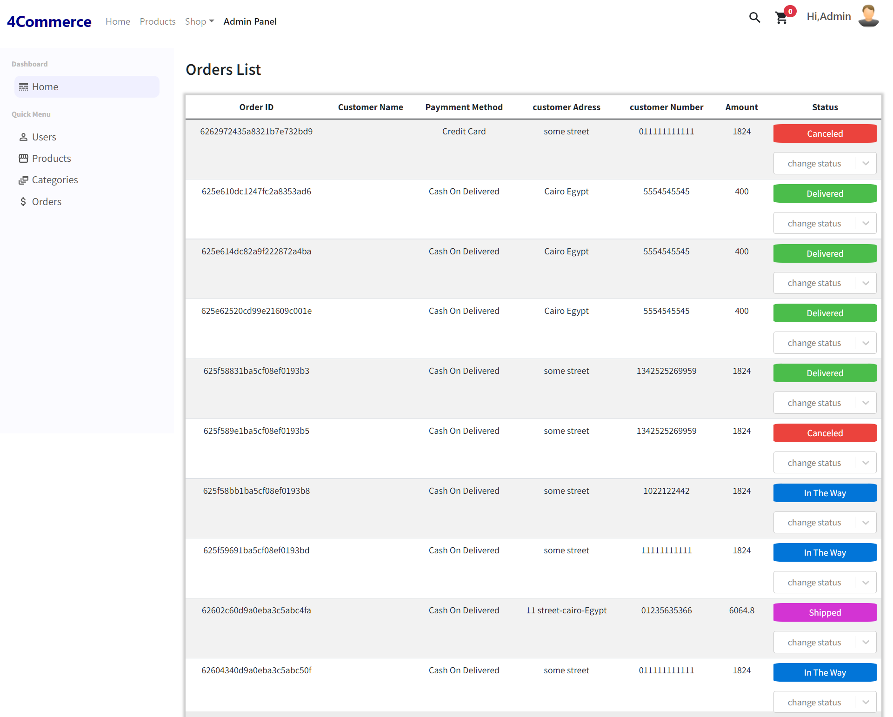

<h1 align="center">
  <br>
  4Commerce
<br>
</h1>

<h4 align="center">An awesome ecommerce web application built on top of <a href="https://nodejs.org/en/" target="_blank">NodeJS</a> by Team4.</h4>

<p align="center">
 <a href="#deployed-version">Demo</a> •
  <a href="#key-features">Key Features</a> •
  <a href="#demonstration">Demonstration</a> •
  <a href="#build-with">Build With</a> •
  <a href="#to-do">To-do</a> •
  <a href="#installation">Installation</a> • 
  <a href="#future-updates">Future Updates</a> • 
</p>
<br>

## Deployed Version

Live demo 👉 : https://ecommerce-team4.netlify.app/

Access Admin Dashboard by login in with admin account 👉 :\
Email: team4fwd@gmail.com\
password : admin@123

## Key Features

- Authentication and Authorization
  - Login, Signup and logout
- Products
  - A User can view products and filter them based on the category or sort them based on the price or the latest
- Search
  - Search bar in which users can search for any product type.
- Product Details
  - when the user clicks on the product image the product’s page will open where the product’s details is available
- Add to Cart
  - The add to cart will allow the user to add the desired products into the cart, when the wish list completes the user will go to the cart and buy products
- Checkout
  - for loged in users they can checkout from cart to specify there shipping address and payment method and procced to order page
- Account setting page
  - Update name, photo, email, and password
- User profile
  - A user can see his/her profile page
  - Update his/her address, photo, phone number, and password
- Admin Dashboard
  - the admin can add products remove or edit products details also view all users and change order and payments status of the purchased products

## Demonstration

#### Home Page :



#### Products Page :



#### Cart Page :



#### Order Page :



#### Profile Page :



#### Login Page :



#### Dashboard Page :



#### Dashboard Users Page :



#### Dashboard Products Page :



#### Dashboard Orders Page :



## Build With

- [NodeJS](https://nodejs.org/en/) - JS runtime environment
- [Express](http://expressjs.com/) - The web framework used
- [Mongoose](https://mongoosejs.com/) - Object Data Modelling (ODM) library
- [MongoDB Atlas](https://www.mongodb.com/cloud/atlas) - Cloud database service
- [React](https://reactjs.org/) - A JavaScript library for building user interfaces
- [JSON Web Token](https://jwt.io/) - Security token
- [Postman](https://www.getpostman.com/) - API testing

## Libraries

- BackEnd
  - mongoose
  - express-fileupload
  - helmet
  - nodemailer
  - cloudinary
  - joi
  - jsonwebtoken
- FrontEnd
  - bootstrap
  - axios
  - redux
  - formik
  - recharts

## To-do

- ADD Payment with Credit Card
- Advanced authentication features
  - confirm user email, login with google or other social media like github and facebook, two-factor authentication
- And More ! There's always room for improvement!

## Installation

You can fork the app or you can git-clone the app into your local machine. Once done that, please install all the
dependencies by running

```
run node app
$ cd Client
$ npm i
$ npm start
on another termenal
$ cd server
$ npm i
set your env variables
$ npm start
```

## Future Updates

- Improve overall UX/UI and fix bugs
- And More ! There's always room for improvement!
